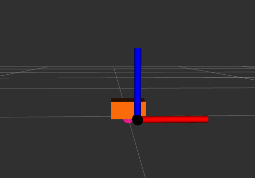
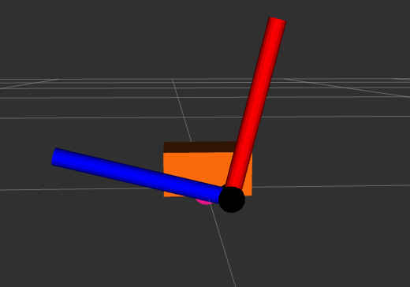

# test2_ros2_control

Este repositorio contiene archivos relacionados con el control ROS 2 (Robot Operating System 2) para el robot RRBot 2.0 el cual es un robot.

|  |  |
| ----------------------------------- | ------------------------------------- |

```
📦test2_ros2control
 ┣ 📂bringup
 ┃ ┣ 📂config
 ┃ ┃ ┣ 📜rrbot_controllers.yaml
 ┃ ┃ ┗ 📜rrbot_forward_velocity_publisher.yaml
 ┃ ┗ 📂launch
 ┃ ┃ ┣ 📜rrbot.launch.py
 ┃ ┃ ┗ 📜test_forward_velocity_controller.launch.py
 ┣ 📂description
 ┃ ┣ 📂launch
 ┃ ┃ ┗ 📜view_robot.launch.py
 ┃ ┣ 📂ros2_control
 ┃ ┃ ┗ 📜rrbot.ros2_control.xacro
 ┃ ┣ 📂rviz
 ┃ ┃ ┗ 📜rrbot.rviz
 ┃ ┗ 📂urdf
 ┃ ┃ ┣ 📜rrbot.materials.xacro
 ┃ ┃ ┣ 📜rrbot.urdf.xacro
 ┃ ┃ ┗ 📜rrbot_description.urdf.xacro
 ┣ 📂hardware
 ┃ ┣ 📂include
 ┃ ┃ ┗ 📂test2_ros2control
 ┃ ┃ ┃ ┣ 📜hardware_constants.hpp
 ┃ ┃ ┃ ┣ 📜rrbot.hpp
 ┃ ┃ ┃ ┗ 📜visibility_control.h
 ┃ ┗ 📜rrbot.cpp
 ┣ 📜CMakeLists.txt
 ┣ 📜LICENSE
 ┣ 📜README.md
 ┣ 📜package.xml
 ┗ 📜test2_ros2control.xml
```

# Índice de Contenidos

1. [Descripción](#descripción)
2. [Hardware](#hardware)
3. [Bringup](#bringup)
4. [Otros archivos](#otros-archivos)

## Descripción

La carpeta `description` contiene archivos relacionados con la descripción del robot RRBot, incluyendo su modelo URDF, el archivo de ros2_control, materiales, lanzamiento de RViz y lanzamiento de visualización del robot.

- `launch`: Contiene un archivo `view_robot.launch.py` para visualizar el robot en RViz.
- `ros2_control`: Contiene el archivo `rrbot.ros2_control.xacro` para la definición del controlador ROS 2 del RRBot.
- `rviz`: Contiene el archivo `rrbot.rviz` para la configuración de la visualización en RViz.
- `urdf`: Contiene los archivos `.xacro` relacionados con la descripción URDF del RRBot.


## Hardware

La carpeta `hardware` contiene archivos relacionados con el hardware del RRBot, incluyendo la implementación del controlador en C++.

- `include`: Contiene archivos de inclusión para el controlador y las constantes de hardware.
- `rrbot.cpp`: Implementación del controlador en C++ para el RRBot.

## Bringup

La carpeta `bringup` contiene archivos relacionados con el inicio y configuración del sistema ROS 2 para el RRBot.

- `config`: Contiene archivos de configuración YAML para los controladores del RRBot.
- `launch`: Contiene archivos de lanzamiento para iniciar el sistema ROS 2 y los controladores del RRBot.

## Otros archivos

- `CMakeLists.txt`: Archivo de configuración de CMake para compilar el proyecto.
- `LICENSE`: Licencia de uso del software.
- `README.md`: Este archivo README en formato Markdown.
- `package.xml`: Archivo de descripción del paquete ROS.
- `test2_ros2control.xml`: Otro archivo de configuración del proyecto.

ros2 topic pub /forward_velocity_controller/commands std_msgs/msg/Float64MultiArray "data: - 0.5"
